```mermaid
flowchart TD
    Start([Inicio]) --> Init[Inicializar Serial<br/>115200 baudios]
    Init --> Input1[/Leer Parcial 1/]
    Input1 --> Valid1{¿Nota válida<br/>0-5?}
    Valid1 -->|No| Input1
    Valid1 -->|Sí| Input2[/Leer Parcial 2/]
    Input2 --> Valid2{¿Nota válida<br/>0-5?}
    Valid2 -->|No| Input2
    Valid2 -->|Sí| Input3[/Leer Parcial 3/]
    Input3 --> Valid3{¿Nota válida<br/>0-5?}
    Valid3 -->|No| Input3
    Valid3 -->|Sí| Input4[/Leer Examen Final/]
    Input4 --> Valid4{¿Nota válida<br/>0-5?}
    Valid4 -->|No| Input4
    Valid4 -->|Sí| Calc[Calcular Nota Definitiva<br/>P1×0.3 + P2×0.2 + P3×0.2 + EF×0.3]
    Calc --> ShowData[/Mostrar todas las notas/]
    ShowData --> Decision1{Nota >= 3.0?}
    Decision1 -->|Sí| Aprueba[/Mostrar: APRUEBA/]
    Decision1 -->|No| Decision2{Nota >= 2.5?}
    Decision2 -->|Sí| Reprueba[/Mostrar: REPRUEBA/]
    Decision2 -->|No| Transicion[/Mostrar: TRANSICIÓN/]
    Aprueba --> Wait[/Esperar Enter/]
    Reprueba --> Wait
    Transicion --> Wait
    Wait --> Input1
```

```mermaid
flowchart TD
    Start([Inicio]) --> Init[Inicializar Serial<br/>115200 baudios]
    Init --> Input[/Leer número real/]
    Input --> Show[/Mostrar número ingresado/]
    Show --> Check{¿Número > 0?}
    Check -->|Sí| Positive[/Mostrar: POSITIVO/]
    Check -->|No| CheckNeg{¿Número < 0?}
    CheckNeg -->|Sí| Negative[/Mostrar: NEGATIVO/]
    CheckNeg -->|No| Zero[/Mostrar: CERO/]
    Positive --> Wait[/Esperar Enter/]
    Negative --> Wait
    Zero --> Wait
    Wait --> Input
```

```mermaid
flowchart TD
    Start([Inicio]) --> Init[Inicializar Serial<br/>115200 baudios]
    Init --> Input1[/Leer Salario Base/]
    Input1 --> Valid{¿Salario > 0?}
    Valid -->|No| Input1
    Valid -->|Sí| Menu[/Mostrar menú de categorías 1-4/]
    Menu --> Input2[/Leer Categoría/]
    Input2 --> Switch{Categoría}
    Switch -->|1| Cat1[Bonificación = 15%<br/>Descuento = 4%]
    Switch -->|2| Cat2[Bonificación = 13%<br/>Descuento = 3%]
    Switch -->|3| Cat3[Bonificación = 12%<br/>Descuento = 2%]
    Switch -->|4| Cat4[Bonificación = 9.5%<br/>Descuento = 0%]
    Switch -->|Otro| Default[Usar categoría 4<br/>por defecto]
    Cat1 --> Calc[Calcular:<br/>Salario + Bonificación = Subtotal<br/>Subtotal - Descuento = Neto]
    Cat2 --> Calc
    Cat3 --> Calc
    Cat4 --> Calc
    Default --> Calc
    Calc --> Display[/Mostrar desglose completo:<br/>Base, Bonificación, Descuento, Neto/]
    Display --> Wait[/Esperar Enter/]
    Wait --> Input1
```

```mermaid
flowchart TD
    Start([Inicio]) --> Init[Inicializar Serial<br/>115200 baudios]
    Init --> Input1[/Leer Número 1/]
    Input1 --> Input2[/Leer Número 2/]
    Input2 --> Input3[/Leer Número 3/]
    Input3 --> Show[/Mostrar los 3 números/]
    Show --> Menu[/Mostrar menú:<br/>1-Promedio, 2-Mayor<br/>3-Menor, 4-Par/Impar/]
    Menu --> InputOp[/Leer Opción/]
    InputOp --> Switch{Opción}
    
    Switch -->|1| Op1[Calcular:<br/>Promedio = Suma/3]
    Op1 --> Display1[/Mostrar Promedio/]
    
    Switch -->|2| Op2[Comparar números<br/>Encontrar el Mayor]
    Op2 --> Display2[/Mostrar Mayor/]
    
    Switch -->|3| Op3[Comparar números<br/>Encontrar el Menor]
    Op3 --> Display3[/Mostrar Menor/]
    
    Switch -->|4| Op4[Verificar cada número:<br/>¿n % 2 == 0?<br/>Contar pares e impares]
    Op4 --> Display4[/Mostrar conteo:<br/>Pares e Impares/]
    
    Switch -->|Otro| Error[/Mostrar: Opción inválida/]
    
    Display1 --> Wait[/Esperar Enter/]
    Display2 --> Wait
    Display3 --> Wait
    Display4 --> Wait
    Error --> Wait
    Wait --> Input1
```

# Taller de Estructuras de Decisión en C para Microcontroladores

**Curso:** Microcontroladores 1 - Programación  
**Facultad:** Tecnología - Ingeniería Mecatrónica  
**Instructor:** Ing. Jeronimo Jaramillo Bejarano  
**Fecha:** Octubre 15 de 2025

## Autores

- **Miguel Angel Luna Garcia** - Estudiante de Ingeniería Mecatrónica
- **Gustavo Adolfo Quintero Bedoya** - Estudiante de Ingeniería Mecatrónica

## Objetivo

Familiarizar a los estudiantes con las estructuras básicas de decisión (`if`, `else`, `switch case`) de la programación en lenguaje C para microcontroladores.

## Requisitos

- **Hardware:** ESP32
- **Software:** Arduino IDE
- **Herramienta de diagramas:** yED (para diagramas de flujo)
- **Control de versiones:** Git/GitHub

## Estructura del Proyecto

```
micros-1-taller-1/
├── ejercicio1_nota_definitiva/
│   └── ejercicio1_nota_definitiva.ino
├── ejercicio2_clasificar_numero/
│   └── ejercicio2_clasificar_numero.ino
├── ejercicio3_salario_neto/
│   └── ejercicio3_salario_neto.ino
├── ejercicio4_operaciones_tres_numeros/
│   └── ejercicio4_operaciones_tres_numeros.ino
├── ejercicio5_ley_ohm/
│   └── ejercicio5_ley_ohm.ino
└── README.md
```

## Ejercicios

### Ejercicio 1: Cálculo de Nota Definitiva
**Archivo:** `ejercicio1_nota_definitiva.ino`  
**🔗 Simular en Wokwi:** [https://wokwi.com/projects/444913328045809665](https://wokwi.com/projects/444913328045809665)

Calcula la nota definitiva de programación con los siguientes porcentajes:
- Primer parcial: 30%
- Segundo parcial: 20%
- Tercer parcial: 20%
- Examen final: 30%

**Criterios de evaluación:**
- Si la nota ≥ 3.0: **APRUEBA**
- Si 2.5 ≤ nota < 3.0: **REPRUEBA**
- Si nota < 2.5: **TRANSICIÓN**

**Características:**
- Validación de notas en el rango 0-5
- Estructura de decisión múltiple (`if-else if-else`)
- Interfaz clara en el monitor serial

---

### Ejercicio 2: Clasificador de Números
**Archivo:** `ejercicio2_clasificar_numero.ino`  
**🔗 Simular en Wokwi:** [https://wokwi.com/projects/444914215392864257](https://wokwi.com/projects/444914215392864257)

Determina si un número real ingresado es:
- **Positivo** (> 0)
- **Negativo** (< 0)
- **Cero** (= 0)

**Características:**
- Acepta números decimales
- Estructura de decisión múltiple
- Interfaz simple y clara

---

### Ejercicio 3: Cálculo de Salario Neto
**Archivo:** `ejercicio3_salario_neto.ino`  
**🔗 Simular en Wokwi:** [https://wokwi.com/projects/444918370527618049](https://wokwi.com/projects/444918370527618049)

Calcula el salario neto según la categoría del empleado:

| Categoría | Bonificación | Descuento |
|-----------|--------------|-----------|
| 1         | 15%          | 4%        |
| 2         | 13%          | 3%        |
| 3         | 12%          | 2%        |
| 4         | 9.5%         | 0%        |

**Características:**
- Utiliza estructura `switch-case`
- Calcula: Salario + Bonificación - Descuento
- Muestra desglose detallado de nómina
- Validación de categorías

---

### Ejercicio 4: Operaciones con Tres Números
**Archivo:** `ejercicio4_operaciones_tres_numeros.ino`  
**🔗 Simular en Wokwi:** [https://wokwi.com/projects/444918890478774273](https://wokwi.com/projects/444918890478774273)

Menú de operaciones con tres números:
1. **Calcular el promedio**
2. **Determinar el número mayor**
3. **Determinar el número menor**
4. **Contar números pares e impares**

**Características:**
- Estructura `switch-case` para el menú
- Manejo de números decimales
- Análisis completo de paridad

---

### Ejercicio 5: Calculadora Ley de Ohm
**Archivo:** `ejercicio5_ley_ohm.ino`  
**🔗 Simular en Wokwi:** [https://wokwi.com/projects/444919024706998273](https://wokwi.com/projects/444919024706998273)

Calculadora basada en la Ley de Ohm: **V = I × R**

Permite calcular:
1. **Resistencia:** R = V / I
2. **Voltaje:** V = I × R
3. **Corriente:** I = V / R

**Características:**
- Estructura `switch-case` para el menú
- Validación de divisiones por cero
- Unidades claras (V, A, Ω)
- Formato de salida profesional

---

## 🌐 Simulaciones en Wokwi

Todos los ejercicios están disponibles para simular en línea sin necesidad de hardware físico:

| Ejercicio | Descripción | Enlace Wokwi |
|-----------|-------------|--------------|
| **Ejercicio 1** | Cálculo de Nota Definitiva | [🔗 Simular](https://wokwi.com/projects/444913328045809665) |
| **Ejercicio 2** | Clasificador de Números | [🔗 Simular](https://wokwi.com/projects/444914215392864257) |
| **Ejercicio 3** | Cálculo de Salario Neto | [🔗 Simular](https://wokwi.com/projects/444918370527618049) |
| **Ejercicio 4** | Operaciones con Tres Números | [🔗 Simular](https://wokwi.com/projects/444918890478774273) |
| **Ejercicio 5** | Calculadora Ley de Ohm | [🔗 Simular](https://wokwi.com/projects/444919024706998273) |

**Ventajas de Wokwi:**
- ✅ No requiere hardware físico
- ✅ Simulación en tiempo real
- ✅ Monitor Serial integrado
- ✅ Acceso desde cualquier navegador
- ✅ Perfecto para pruebas rápidas

---

## Cómo Usar

### 1. Abrir un Ejercicio en Arduino IDE
1. Abre Arduino IDE
2. Ve a `Archivo > Abrir`
3. Navega a la carpeta del ejercicio deseado
4. Selecciona el archivo `.ino`

### 2. Configurar la ESP32
1. Ve a `Herramientas > Placa > ESP32 Arduino`
2. Selecciona tu modelo de ESP32
3. Selecciona el puerto COM correcto en `Herramientas > Puerto`

### 3. Subir el Código
1. Haz clic en el botón "Subir" (→)
2. Espera a que compile y cargue

### 4. Usar el Monitor Serial
1. Abre el Monitor Serial: `Herramientas > Monitor Serial`
2. Configura la velocidad a **115200 baudios**
3. Sigue las instrucciones en pantalla
4. Ingresa los datos cuando se soliciten
5. Presiona Enter para enviar

---

## Notas Técnicas

### Comunicación Serial
Todos los programas usan:
- **Velocidad:** 115200 baudios
- **Entrada:** Monitor Serial de Arduino IDE
- **Salida:** Monitor Serial de Arduino IDE

### Funciones Auxiliares
Cada programa incluye funciones reutilizables:
- `leerNumero()`: Lee números decimales del puerto serial
- `leerEntero()`: Lee números enteros
- `leerNumeroPositivo()`: Lee y valida números positivos
- `esperarEnter()`: Pausa el programa hasta presionar Enter

### Validaciones Implementadas
- Rangos válidos de entrada
- División por cero (Ejercicio 5)
- Conversión de valores negativos a positivos donde aplique
- Limpieza de buffer serial

---

## Diagramas de Flujo

A continuación se presentan los diagramas de flujo para cada ejercicio en formato Mermaid, que se pueden visualizar directamente en GitHub.

### Ejercicio 1: Cálculo de Nota Definitiva



### Ejercicio 2: Clasificador de Números



### Ejercicio 3: Cálculo de Salario Neto



### Ejercicio 4: Operaciones con Tres Números



### Ejercicio 5: Calculadora Ley de Ohm



```mermaid
flowchart TD
    Start([Inicio]) --> Init[Inicializar Serial<br/>115200 baudios]
    Init --> Menu[/Mostrar menú:<br/>1-Calcular R<br/>2-Calcular V<br/>3-Calcular I/]
    Menu --> InputOp[/Leer Opción 1-3/]
    InputOp --> Switch{Opción}
    
    Switch -->|1| InputV1[/Leer Voltaje V/]
    InputV1 --> InputI1[/Leer Corriente I/]
    InputI1 --> CheckI{¿I == 0?}
    CheckI -->|Sí| ErrorDiv1[/Error: División por cero/]
    CheckI -->|No| CalcR[Calcular: R = V / I]
    CalcR --> DisplayR[/Mostrar R en Ohmios/]
    
    Switch -->|2| InputI2[/Leer Corriente I/]
    InputI2 --> InputR2[/Leer Resistencia R/]
    InputR2 --> CalcV[Calcular: V = I × R]
    CalcV --> DisplayV[/Mostrar V en Voltios/]
    
    Switch -->|3| InputV3[/Leer Voltaje V/]
    InputV3 --> InputR3[/Leer Resistencia R/]
    InputR3 --> CheckR{¿R == 0?}
    CheckR -->|Sí| ErrorDiv2[/Error: División por cero/]
    CheckR -->|No| CalcI[Calcular: I = V / R]
    CalcI --> DisplayI[/Mostrar I en Amperios/]
    
    Switch -->|Otro| ErrorOp[/Mostrar: Opción inválida/]
    
    DisplayR --> Wait[/Esperar Enter/]
    DisplayV --> Wait
    DisplayI --> Wait
    ErrorDiv1 --> Wait
    ErrorDiv2 --> Wait
    ErrorOp --> Wait
    Wait --> Menu
```

### Convenciones de los Diagramas

Los diagramas utilizan las siguientes convenciones:
- **Óvalos redondeados** `([...])`: Inicio/Fin
- **Rectángulos** `[...]`: Procesos y cálculos
- **Paralelogramos** `[/..../]`: Entrada/Salida
- **Rombos** `{...}`: Decisiones
- **Flechas**: Flujo del programa

Estos diagramas se visualizan automáticamente en GitHub y pueden ser editados fácilmente.

---

## Control de Versiones (Git)

### Inicialización del Repositorio original
```powershell
cd "d:\Users\migue\Documents\Tareas\Microcontroladores_1\micros-1-taller-1"
git init
git add .
git commit -m "Initial commit"
```

### Creación del Repositorio en GitHub
1. Creamos un nuevo repositorio en GitHub
2. Conectamos el repositorio local:
```powershell
git remote add origin https://github.com/MiguelLuna02/micros-1-taller-1.git
git branch -M main
git push -u origin main
```

### .gitignore Recomendado
```
# Arduino
*.hex
*.elf
*.bin

# Build files
build/
*.o

# OS
.DS_Store
Thumbs.db
```

---

## Ejemplos de Uso

### Ejercicio 1: Nota Definitiva
```
Ingrese la nota del primer parcial (0-5): 
4.5
Ingrese la nota del segundo parcial (0-5): 
3.8
Ingrese la nota del tercer parcial (0-5): 
4.2
Ingrese la nota del examen final (0-5): 
4.0

========== RESULTADOS ==========
NOTA DEFINITIVA: 4.15
Estado: APRUEBA ✓
```

### Ejercicio 5: Ley de Ohm
```
Opción (1-3): 1

Ingrese el voltaje (V) en voltios: 12
Ingrese la corriente (I) en amperios: 0.5

========== RESULTADO ==========
Voltaje (V): 12.0000 V
Corriente (I): 0.5000 A
-------------------------------
Resistencia (R): 24.0000 Ω (Ohmios)
===============================
```

---

## Solución de Problemas

### El monitor serial no muestra nada
- Verifica que la velocidad sea **115200 baudios**
- Asegúrate de que el puerto COM sea el correcto
- Presiona el botón de reset en la ESP32

### Los números no se leen correctamente
- Asegúrate de presionar Enter después de ingresar el número
- Verifica que no haya caracteres extra en la entrada

### Error al compilar
- Verifica que tengas instalado el soporte para ESP32 en Arduino IDE
- Actualiza las librerías del core de ESP32

---

## Licencia

Este proyecto es parte de las actividades académicas del curso de Microcontroladores 1.
